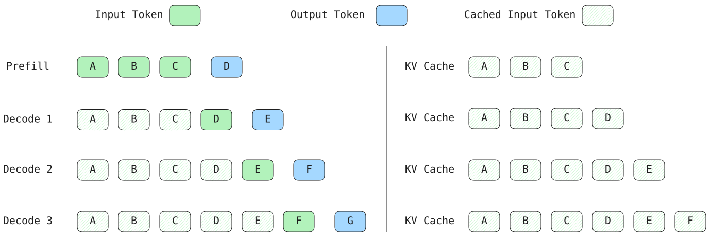

这一章不碰源码，也不看任何类的层次。目标只有一个：**把"给一个 prompt、让它生成一段话"这件事，从概念上想清楚。**

## 先看最小的一段

```python
from vllm import LLM, SamplingParams

llm = LLM(model="Qwen/Qwen3.5-0.8B")
out = llm.generate(["你好，请用一句话介绍你自己"], SamplingParams(temperature=0.8))
print(out[0].outputs[0].text)
```

这里的 `Offline`（离线）是说：一批 prompt 一次性喂进去，等结果，不需要考虑并发请求、流式返回、服务稳定这些事。它是 vLLM 用得最少、但结构最清楚的一个入口，适合拿来开头。

## 一次生成，其实是两步

大模型生成文字是**自回归**的：一次只吐一个 token，然后把新 token 接到后面，再吐下一个。所以"生成 100 个 token"就是做了 100 多次前向。

但第一次前向和后面每一次很不一样：

第一次要把整个 prompt（假设 20 个 token）从头过一遍，算出所有位置的结果。这一步叫 **prefill**。

之后的每一次，上下文里只有"前面所有 token"和"新加进来的那个 token"。前面那些 token 的结果其实已经算过了，不用重算——只需要处理最新这一个。这一步叫 **decode**。

所以一次生成 = **1 次 prefill + N 次 decode**，一共产出 **N+1** 个 token——prefill 出第 1 个，之后每 decode 一次再出一个。

## decode 只算 1 个 token，靠的是 KV cache

prefill 之后，每一步 decode 只处理一个刚生成的 token。为什么可以不管前面那几十上百个 token？

因为它们在之前的前向里已经算过了，结果被存了下来。存的是每个 token 在每一层算出的 **Key 和 Value**，合起来叫 **KV cache**。

不存会怎样？每一步 decode 都得把前面所有 token 重算一遍——生成第 100 个 token 要算 100 个 token 的量，第 1000 个要算 1000 个，整体是平方级。所以 KV cache 不是"优化项"，是自回归生成能跑起来的前提。

## 代价是显存，而且浪费得很厉害

KV cache 必须待在显存里。序列越长、并发越多，它越大；长 prompt 配长输出的时候，甚至比模型权重本身还大。

但论文（PagedAttention，SOSP 2023）把问题又往前推了一步。摘要里有句话点得很准：

> the KV cache memory for each request is huge and grows and shrinks dynamically. When managed inefficiently, this memory can be significantly wasted by fragmentation and redundant duplication, **limiting the batch size**.

意思是：KV cache 又大又动态，管理不当就会被**碎片**和**冗余重复**大量浪费，而这份浪费直接**限制了 batch size**。

## 为什么"限制 batch size"是致命的

因为吞吐要靠批处理。而批处理为什么必要，得先看 GPU 是怎么干活的。

权重放在**显存**里，真正做运算的是**计算单元**，而计算单元装不下整个模型。所以每算一次前向，都得把这一层要用的权重从显存搬进计算单元。

decode 一个 token 时，几乎所有层的权重都要被读一遍（唯一的例外是输入 embedding 只查一行，可以忽略）。那计算量呢？一层里的核心运算是"权重矩阵 × 输入向量"。设权重矩阵是 $m \times n$，输入是长度 $m$ 的向量：

$$
y_j = \sum_i W_{ij}\, x_i \qquad (j = 1, \dots, n)
$$

数一下就会发现：每个权重 $W_{ij}$ 只参与**一次**乘加。所以这一层的乘加次数正好等于权重个数 $m \times n$。整个模型串起来就是——**有多少个参数，就做多少次乘加**。

于是单个请求的 decode 是：搬 $N$ 个权重，做 $N$ 次乘加，两个数一个量级。

问题出在 GPU 的性格上。以 H100 为例，bf16 算力约 **990 TFLOP/s**，显存带宽约 **3.35 TB/s**，比值约 **300 FLOP/字节**——每搬 1 字节，得做上 300 次浮点运算才不亏带宽。而单请求 decode 是什么强度？搬 2 字节（一个 bf16 权重）只做 **1 次乘加**；算力指标里一次乘加记作 2 次浮点运算（1 乘 1 加），所以强度是 $2 \div 2 =$ **1 FLOP/字节**。差 300 倍，计算单元绝大部分时间在等数据。这就是"空转"。

解法是把多个请求的 decode 凑一起跑。这里有个容易误解的点：批处理**不是**让总搬运量不变——每个请求自己的激活值、KV cache 读写都会随 $B$ 涨。真正省下来的是**权重**，因为它是所有请求共用的同一份：

| 处理 $B$ 个请求的方式 | 权重搬运量 | 计算量 |
|---------------------|-----------|--------|
| 一个一个跑 | $B \times N$ | $B \times N$ |
| 批量跑 | $1 \times N$ | $B \times N$ |

权重搬运从 $B \times N$ 降到 $N$，摊到每个请求只剩 $1/B$。权重通常正是最大的一块：0.8B 模型的 bf16 权重约 1.6 GB，而单步激活值只有几十到几百 KB，差好几个数量级。只要"激活值远小于权重"成立，强度就近似从 1 涨到 $B$ FLOP/字节。

**但批处理最终能开多大，被 KV cache 的显存卡着。** 这才是前面那句 "limiting the batch size" 的分量：浪费掉的显存，本来可以多装几个请求。

于是问题收敛成一句话：**怎么把 KV cache 这块显存用得更省、更能共享。**

两个机制的分工也就清楚了：

- **continuous batching**（第 2、3 章）：把多个请求的 decode 凑一起跑，解决 GPU 空转；
- **PagedAttention**（第 4 章）：把 KV cache 的显存管好，让 batch 能开得更大。

## 三个角色

先建立一个很粗的模型。vLLM 内部大致是三个角色在配合：

**引擎循环**——不停地重复三件事：挑一批请求、跑一次前向、把新生成的 token 拼回各自的序列。整个引擎就是一个 loop。

**调度器**——在每轮循环开始时决定：这一批跑哪些请求、每个给多少 token 的预算；如果显存不够，还要决定把谁先踢出去、等会儿再放回来。

**KV cache 管理器**——管那块显存。谁要用、用多少、用完了怎么回收、能不能和别人共用，都归它。

一次生成从头到尾，就是这三个角色转起来的结果。第 5 章会带你看它们在源码里长什么样，现在先把这套配合记在脑子里。

## 先钉一个具体的小例子

干说流程容易虚，先钉死一个最小的例子：prompt 是 3 个 token，记作 A、B、C；让模型生成 4 个 token，记作 D、E、F、G。

| 步骤 | 输入 | 输出 | 这步之后 KV cache 里有什么 |
|------|------|------|--------------------------|
| prefill | A B C（3 个） | **D** | A B C |
| decode 1 | D（1 个） | E | A B C D |
| decode 2 | E（1 个） | F | A B C D E |
| decode 3 | F（1 个） | G | A B C D E F |

盯两列看。

**输入那一列**：只有 prefill 是 3 个 token，后面每次都是 1 个。这里有个容易忽略的点——**prefill 也会产出一个 token（D）**。它不是"预处理"，它就是第 1 次前向，产出的就是第 1 个生成结果。

**KV cache 那一列**：每一步都在变长，每一步都会把新 token 的 K/V 追加进去。

那 decode 为什么只输入 1 个 token 也能算？因为它把 KV cache 里前面所有 token 的 K/V 读出来，和新 token 算出的 K/V 拼在一起，就够算出下一个 token 了。

反过来想：**如果没有 KV cache，每一步都得把 A B C D E F 全部重算一遍**，越往后要重算的历史越长，整体是平方级的开销。所以 KV cache 不是"优化项"，是自回归生成能跑起来的前提。

## 图 1.1

把上面那张表画成图：



四行分别是 prefill 和三次 decode。每行左边是这一步的输入——绿色是这次真正喂进去的 token，斜线的是从 KV cache 读出来的历史；蓝色是这一步产出的 token；右边是这步之后 KV cache 里的内容。

看两处差别就够了：

- **输入**：prefill 一次吃 A B C 三个 token；之后每一步的"新输入"只有一个（D、E、F），其余都从缓存来。
- **KV cache**：每一行末尾都比上一行多一格。decode 能只算 1 个新 token，靠的就是它；否则每步都要把 A~F 全部重算。

## 本章想让你记住的

一句话：**提高吞吐的关键是加大 batch size。** 把更多请求凑一起跑，GPU 就不空转了；但 batch 越大，KV cache 占的显存越多。

所以 vLLM 实际要解决两件事：

- **减少 GPU 空转** → 靠 continuous batching：每一步动态决定哪些请求进出这一批。这套调度，就是第 3 章的 Scheduler 在干的事。
- **提高显存利用率** → 靠 PagedAttention：把 KV cache 按块管理，少浪费、能共享，让同样大小的显存装下更多请求。

两件事是咬合的：**调度决定"想塞多少请求"，显存决定"能塞多少"。**

> 补一个容易记混的点：continuous batching 这个思路并不是 vLLM 首创（这项工作一般归功于 Orca，OSDI 2022），vLLM 是把它和 PagedAttention 结合在一起。**vLLM 真正的核心贡献是"显存"那一半**——因为真正卡住 batch size 的，是 KV cache 的显存。

接下来会**从最简单往复杂走**：

- 第 2 章：现在只有一个请求。如果有 100 个呢？——引出批处理。
- 第 3 章：100 个请求怎么排队、怎么决定谁先跑？——调度器。
- 第 4 章：KV cache 那么大，显存怎么分？——PagedAttention。

先不急着看代码。等这三章的直觉建立起来，再回头读源码，会顺很多。

## 参考资料

- vLLM 0.30.0 源码（后面章节会用）
- Aleksa Gordić，《Inside vLLM: Anatomy of a High-Throughput LLM Inference System》，2025-09-05
- Kwon et al.，《Efficient Memory Management for LLM Serving with PagedAttention》，SOSP 2023
